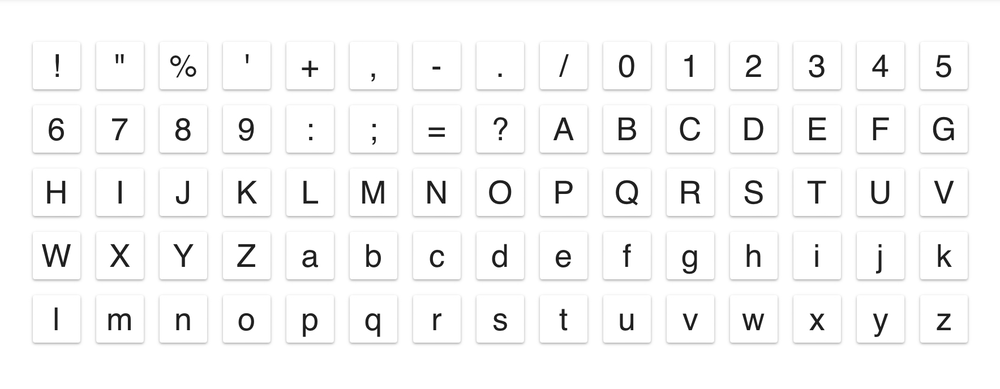
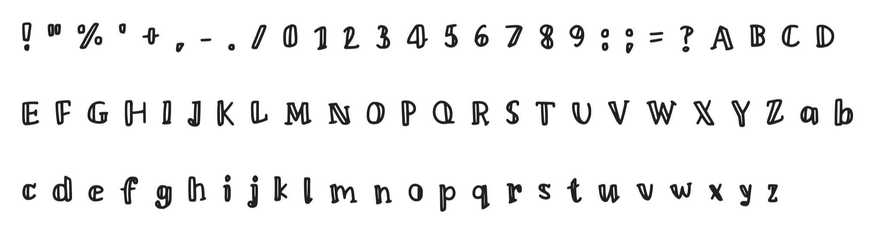
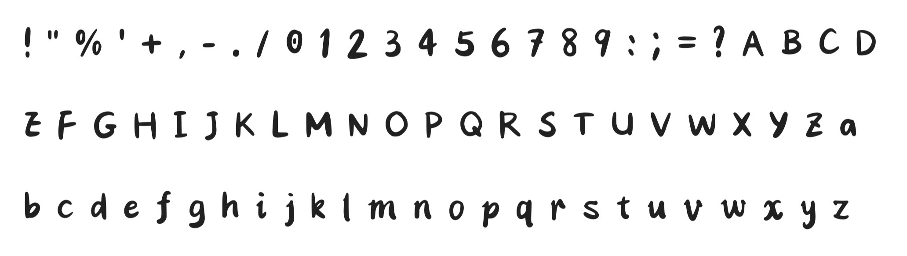

# Rico Font

- [Iosevka](https://github.com/be5invis/Iosevka.git)
- [Maple Mono](https://github.com/subframe7536/maple-font.git)

private-build-plans.toml

```toml
[buildPlans.RicoCode]
exportGlyphNames = false
family = "Rico Code"
noCvSs = true
serifs = "sans"
spacing = "normal"

[buildPlans.RicoCode.variants]
inherits = "ss06"

[buildPlans.RicoCode.variants.design]
at = "compact"
capital-g = "toothed-serifless-hookless"
capital-j = "serifless"
capital-q = "crossing"
diacritic-dot = "round"
j = "serifless"
punctuation-dot = "round"
tittle = "round"
two = "straight-neck-serifless"

[buildPlans.RicoCode.ligations]
inherits = "javascript"

[buildPlans.RicoCode.weights.Regular]
css = 400
menu = 400
shape = 400

[buildPlans.RicoCode.weights.Bold]
css = 700
menu = 700
shape = 700

[buildPlans.RicoCode.slopes.Upright]
angle = 0
css = "normal"
menu = "upright"
shape = "upright"

[buildPlans.RicoCode.slopes.Italic]
angle = 9.4
css = "italic"
menu = "italic"
shape = "italic"
```

- [calligraphr](https://www.calligraphr.com)

contain 75 characters as following images:



**preview**

- Rico_1



- Rico_2


